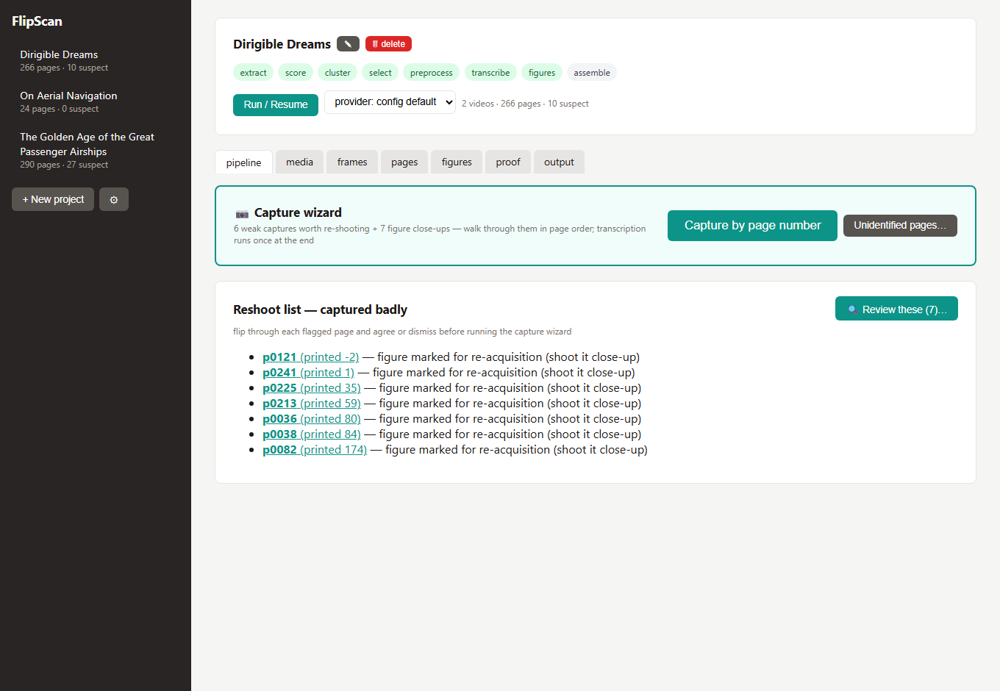
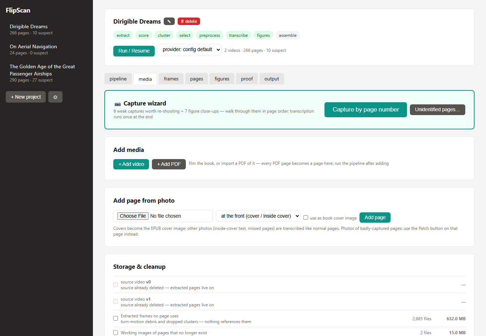
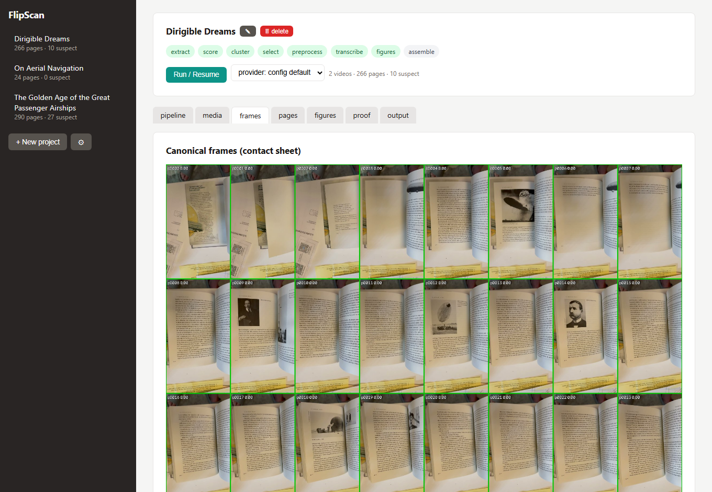
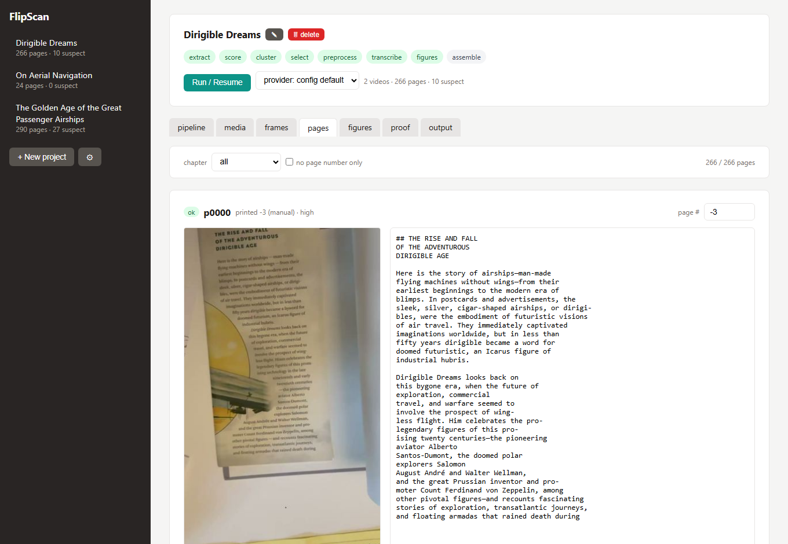
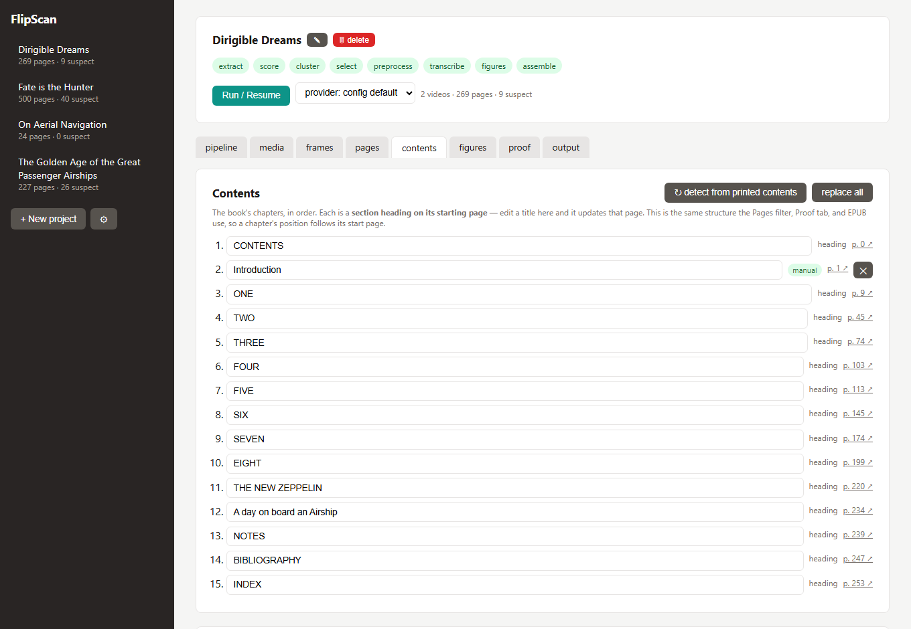
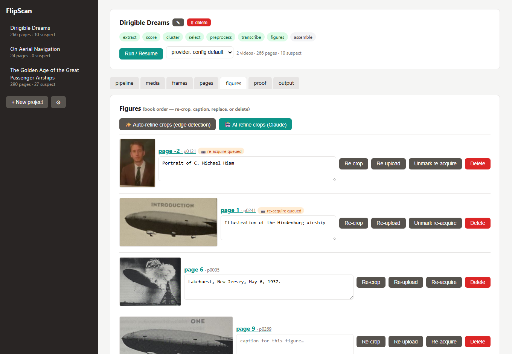
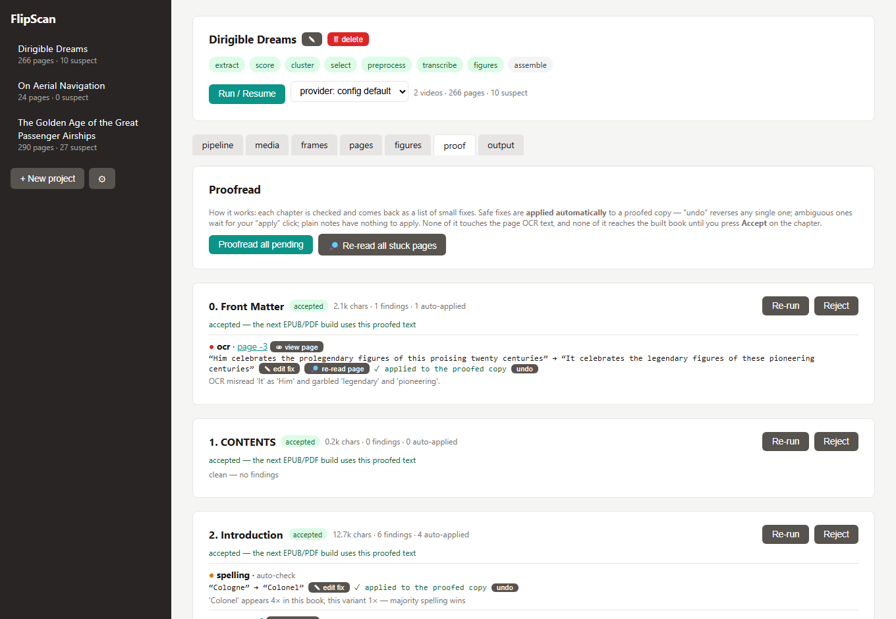
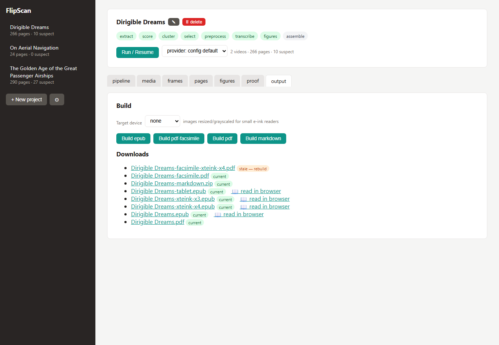

# FlipScan

Turn a phone video of flipping through a book — or a stack of page photos, or a PDF — into a clean, proofread EPUB. FlipScan extracts frames from flip-through videos, scores and clusters them to find individual pages, picks the best frame per page, transcribes each page with a vision LLM (local Ollama, Anthropic API, or a hybrid), reconstructs page order and figures, runs a chapter-by-chapter proofread pass, and builds an EPUB, PDF, Markdown bundle, or a **narrated audiobook (.m4b) with local voice cloning** — surfacing pages it couldn't capture well as a **reshoot list** instead of silently dropping them.

Everything runs through a local web GUI you can drive from your phone on the same network. Nothing about the digitized book leaves your machine unless you opt into the Anthropic backend.

See [SPEC.md](SPEC.md) for the full architecture.


## Starting a project

You give the book a **title** (or look it up) — the folder name is a unique slug generated for you, so you never type or manage an internal name. The **🔍 look up** field searches Google Books / Open Library by ISBN, title, or author and auto-fills title, author, page count, publisher, and year. Creating a project only collects this metadata; you add the videos, PDF, or photos on the project page as the next step. Metadata is editable later (✎), flows into the EPUB's Dublin Core, and — once a book is transcribed — FlipScan reads the ISBN off the copyright page and offers to fill the rest in one click.

## Four ways to get pages in

You can mix all three in one project; page order is reconciled from printed page numbers.

- **Flip-through video** — the fastest for a whole book. **Film it in slow-motion mode** (e.g. 120/240 fps): the extra frames per page turn give FlipScan a sharp, flat frame to pick for every page, which makes the biggest difference to output quality. Thumb through the book (any direction, any subset, as many videos as you like); page turns split each video into page captures, and upside-down videos are auto-detected.
- **Photos** — for the cover, inside-cover text, or any page a video missed. Deliberate photos are used exactly as framed (no warping/cropping). Orientation is auto-checked per shot.
- **PDF** — the alternative to filming: every PDF page is rendered and imported as a page, in authoritative order. Great for scans or born-digital PDFs — including compilations where several works are concatenated and printed page numbers repeat (each restarting at page 1), which are kept in order rather than merged.
- **EPUB** — start from an existing ebook: chapters become editable text pages, images and the cover carry over, and the whole capture/OCR pipeline is skipped (the text is already clean). Perfect for editing an ebook you have, re-exporting it device-sized, or **narrating it into an audiobook** with the full voice-casting flow. (For MOBI/AZW3, convert to EPUB with Calibre first.)

### Capture tips (video)

- Two passes in opposite directions works great: each pass catches the side of the spread that lays flat, so between them every page appears flat and unoccluded.
- Use 240 fps slow-mo if your phone supports it; let each page rest briefly before flipping the next.
- Stiff pages near the covers often need an extra video or a photo — the reshoot list tells you exactly which pages are weak, and the built-in **capture wizard** walks you through re-shooting them in page order.

## The web GUI

`flipscan ui` serves the whole workflow at `http://<your-ip>:8321`. Projects are listed in the sidebar; each has these tabs:

### Pipeline — run, status, reshoot list, capture wizard
Run/resume the pipeline, watch live per-stage progress, and see the **reshoot list** and **missing-pages** gaps. The **capture wizard** steps you through weak or missing pages one at a time; **🔍 Review these** flips through flagged pages so you can agree or dismiss before capturing.

Long work — the pipeline itself, and every chapter proofread and page re-read — runs as a **durable background job**, not inside the request. Close the tab, sleep the phone, or restart the server and the work keeps going; a run interrupted mid-way is automatically requeued and resumes on the next start. Progress and logs are replayed on reconnect, and a hung model call times out and retries instead of wedging the run forever. A sidebar **job-queue chip** shows what's active (e.g. *proofread ch4 · +3 queued*) and opens a **Job queue** panel — the running job with its live log and a Cancel button, the queue in order, and recent results.



### Media — sources & storage
Add videos, photos, or a **PDF**; flip a video's orientation; and a **Storage & cleanup** panel that reports the size of every source video, unused frames, hidden/duplicate pages, and thumbnails, and lets you reclaim space (including deleting processed source videos while keeping the extracted pages).



### Frames — contact sheet
One thumbnail per detected page (red borders on suspects). Check this after the first run on a new book — if clustering miscounted, tune the `[cluster]` thresholds before spending transcription tokens.



### Pages — the heart of it
Every page as a three-row cell: source frame, editable Markdown transcription, and action buttons. Assign/correct the printed page number (manual always wins), mark for re-acquisition, replace the photo, add a figure, rotate, **designate the page as the book cover** (pinned to the front, kept out of the body, used as the EPUB cover), mark duplicate, or hide. **Section heading** makes a page open a chapter — assigning one restructures the book immediately (the printed contents page also seeds chapter titles automatically, normalized to the book's own style). Filter by **chapter** or "no page number only," with a next-section button to work through the book section by section. Missing-page markers appear inline between non-consecutive pages.



### Contents — the table of contents, editable
One place to see and edit the whole chapter structure. It shows the effective chapter list the built book uses — one row per chapter at its start page, tagged **manual** (a heading you set) or **heading** (detected from the page). Edit a title inline, add a chapter (pick the page it starts on), or remove a manual one; every change writes a section heading on that page, so the Pages filter, Proof tab, and EPUB stay in sync. **Auto-detect from the printed contents page** matches each parsed entry to the page with that printed number and fills the headings in — and runs once automatically the first time you open the tab on a book that has a printed contents page but no chapters yet.



### Figures — captions, crops, real-duplicate detection
Every figure in book order, each with an **editable caption** and re-crop / re-upload / **rotate** (90° CW/CCW) / re-acquire / delete. A perspective-correcting **corner crop tool** — corner handles plus **edge-midpoint handles** that slide a whole side of the box in or out, a magnifier loupe, and an edge-detection "magic crop" (optional Claude-vision refinement) — fixes bounding boxes. A figure you **re-acquire** by shooting a dedicated close-up is kept as its own standalone image (re-cropping trims the close-up, not the page) and survives later re-transcribes. Pages with several figures each keep their own caption — a **⇅ swap** fixes transposed captions — and only genuinely identical images (matched by perceptual hash) are flagged as duplicates.



### Proof — chapter-by-chapter proofread
A distinct, non-destructive layer: each chapter is checked and comes back as a list of small fixes (OCR misreads, hyphenation, garbled passages). Safe fixes auto-apply to a *proofed copy*; ambiguous ones wait for a click; notes you resolve yourself with **✎ write a fix**, **👁 view page** (a movable pane of the source image beside the quote), or **🔎 re-read page** (the vision model re-reads the passage from the page image). **Re-read all stuck pages** does that in bulk so you focus only on what's left. Each proofread and re-read runs as a **durable background job** — and several chapters proofread **in parallel** — so "proofread all" moves quickly and closing the tab or a dropped connection won't lose the minutes of model work. The page OCR text is never touched, and nothing reaches the built book until you **Accept** a chapter.



### Output — build & read
Two sections, each with its own downloads list: **📖 Book files** and **🎧 Audiobook**.

Build **EPUB**, **PDF facsimile**, **reflowed PDF**, an optional **high-quality LaTeX PDF**, or a **Markdown zip** (Markdown + `images/`, YAML frontmatter — portable to Obsidian/Typora/Pandoc), optionally sized for a target e-ink device. Pick a **Target device** (e.g. **reMarkable 2**) and images are resized/grayscaled *and* the reflowed PDF is page-sized to the exact panel with e-ink-tuned typography (darker greys, open leading, no widows/orphans) so it's readable at native scale with no on-device zoom. The **pdf (LaTeX ✨)** output runs pandoc + XeLaTeX for the best typography (same device page-sizing) — it needs those tools installed (the button is disabled until they're on your PATH); everything else needs nothing extra. **🎧 Audiobook**: narrate the proofed book into a chaptered **`.m4b`** with a local voice model — pick the built-in narrator or any **cloned voice from your shared library** (record one in the browser against a guided passage, or upload a sample), choose a **speed** (1×–2×), and see a **length + GPU-time estimate** before you commit. Chapter titles are spoken as audible breaks; cover art and metadata are embedded; each build saves as `book--voice--datetime.m4b` so long runs never overwrite. See *Optional: audiobook output* below for setup.

Outputs are marked **stale** the moment any page, figure, or proof changes — and each download says *what* changed (book text, figures, proofs, cover) and when it was built. EPUBs get a **read-in-browser** link — a built-in reader with chapter navigation, light/dark, font sizing, per-figure re-crop/re-capture, and flag-this-passage. A **device view** lets you read comfortably (filling the window) or **simulate a device**: the book renders at the panel's exact pixel size inside a bezel (e.g. reMarkable 2), grayscaled for e-ink, so you can see how it'll really look before sending it over.



## Quickstart

### Docker

```sh
docker compose up --build
# drop videos/PDFs into ./books, open http://localhost:8321
```

Compose brings up **two services** sharing the `./books` volume: the **web** GUI and a dedicated **worker** that runs the durable job queue (pipeline, proofreads, re-reads). Because the worker is its own container, restarting or redeploying the web server never interrupts a running job. `./books` is mounted as `/data`: sources go in, outputs come out, every workspace persists on the host — including `jobs.db`, the shared queue. Set `FLIPSCAN_OLLAMA_URL` (your Ollama server's LAN IP works from the container) and `FLIPSCAN_PROVIDER` via environment or a `.env` next to `docker-compose.yml`.

### Dev install (no Docker)

```sh
pip install -e ".[ui,dev]"       # requires ffmpeg on PATH
flipscan ui                      # prints your LAN URL, e.g. http://192.168.x.x:8321
```

All output formats (EPUB, reflowed & facsimile PDF, Markdown zip) work from the base install — no weasyprint/GTK/pandoc needed. The projects folder is created for you on startup.

The one exception is the optional **pdf (LaTeX)** output, which needs `pandoc` + `xelatex` on your PATH (with the TeX Gyre fonts from `texlive-fonts-recommended` — no extra font install):

```sh
# Debian/Ubuntu
sudo apt install pandoc texlive-xetex texlive-fonts-recommended
# macOS:   brew install pandoc  +  MacTeX (https://tug.org/mactex/)
# Windows: winget install JohnMacFarlane.Pandoc  +  winget install MiKTeX.MiKTeX
```

The Docker image already includes these, so the LaTeX PDF works there out of the box.

### Optional: audiobook output (local TTS + voice cloning)

The output tab can narrate the proofed book into a chaptered **`.m4b` audiobook** using a local voice model — nothing leaves your machine. It uses [Chatterbox TTS](https://github.com/resemble-ai/chatterbox) (MIT, by Resemble AI):

```sh
pip install chatterbox-tts
# for GPU speed (recommended — CPU synthesis is very slow):
pip install torch==2.6.0 torchaudio==2.6.0 --index-url https://download.pytorch.org/whl/cu124 --force-reinstall --no-deps
```

- Narrates the same proofed text the EPUB uses; skips figures/tables; each chapter's title is spoken as an audible break, and chapter markers, cover art, and title/author metadata are embedded in the `.m4b`.
- **Voice library & cloning:** record a 10–30 s sample in the browser (a guided reading passage is provided) or upload one, give it a name, and it joins a library **shared across all your books** — pick any voice (or the built-in narrator) from the dropdown per build. Only use a voice that's yours or whose owner has agreed. Recording from a phone needs the **https** URL printed at startup (accept the self-signed certificate warning once).
- **Speed** (1× / 1.25× / 1.5× / 2×): time-compresses the narration (pitch preserved, chapter markers rescaled). It shortens the audiobook, not the generation — but chapters are cached, so re-rendering the same narration at a new speed takes seconds.
- **Full-cast narration (🎭)**: *Analyze characters* runs a text-LLM pass per chapter that finds quoted speech and who says it, building a cast list with descriptions and sample quotes. Assign any library voice to each character and tick *cast voices* — quotes render in their character's voice while the narrator keeps everything else (including "he said" tags). Uncertain attributions stay with the narrator; best on fiction and dialogue-heavy memoirs.
- The card shows an **estimate** before you commit the GPU (≈1,200 chars/min of narration; synthesis ≈1.1× the audio length at 1×). A full book is hours — it runs as a durable job (⚙ queue), survives restarts, and re-builds only re-narrate chapters whose text changed.
- Each build saves as `book--voice[--speed]--datetime.m4b`, so a long run never overwrites an earlier one. Every output's stale badge says *what* changed since it was built (book text, figures, proofs, cover).
- The model (~2 GB) downloads from Hugging Face on first build. ~6 GB VRAM recommended; synthesis shares the GPU with local OCR, so avoid running a pipeline and an audiobook at the same time on small cards.
- Not bundled in the Docker image (it would add ~5 GB) — install it in the container or run the audiobook build from a host install.

### From your phone

`flipscan ui` (and the Docker container) listen on all interfaces and print a "your network" URL — open it on your phone. New project → **Add video / Add PDF / Add page from photo**. On a phone the sidebar collapses to a hamburger menu, and the pages/figures tools are finger-sized.

The server also listens on **https at port+1** (default `https://<your-ip>:8322`) with a self-signed certificate — phone browsers only allow **microphone access** (the voice-clone recorder) over https, so use that URL on the phone and accept the certificate warning once.

If another device can't reach it on Windows, allow the ports once (admin PowerShell):
`netsh advfirewall firewall add rule name="FlipScan GUI" dir=in action=allow protocol=TCP localport=8321-8322 profile=private`
Use `--host 127.0.0.1` to keep the GUI private to this machine.

## Backends

Set globally in Settings (⚙) or per-workspace `config.toml`.

- **Ollama** (default): your existing Ollama server. Free, private, slower and less accurate on dense text. Requests use `format: json` and a strict schema. Developed and tested with **`gemma4:31b`** (a vision model with a good accuracy/speed balance for page transcription) — `ollama pull gemma4:31b`, then set it in Settings (⚙) or as `ollama_model`.
- **Anthropic**: higher accuracy, via the **Message Batches API** (50% discount; a 300-page book is one batch). A settings toggle disables all API calls while keeping your key saved, so you never spend by accident.
- **OpenAI-compatible**: one provider for the many vendors that speak the OpenAI Chat Completions API with vision + JSON mode — set a **base URL + API key + model**. One-click presets for **OpenAI** (`gpt-4o`), **Google Gemini** (its OpenAI endpoint), and **OpenRouter** (dozens of vision models behind one key); also works with Groq, Together, Azure, or a local vLLM/LM Studio server. Note: this sends each page image to that provider (unlike local Ollama).
- **Hybrid**: every page goes through Ollama first; only pages that come back low-confidence, malformed, or flagged are re-run through a cloud provider — Anthropic or the OpenAI-compatible one, chosen by `escalate_to`. Tune the triggers via `escalate_on`.
- **Mock**: placeholder text, no model calls — for testing the plumbing.

### Provider settings (⚙)

Open **Settings** from the sidebar (⚙). Everything here is global — it applies to every project — and is saved to `config.toml` in your projects folder (the API keys never leave that machine and are gitignored). Fields:

- **Transcription provider** — `ollama` · `anthropic` · `openai` · `hybrid` · `mock`. This picks which backend the pipeline (and per-page retry-OCR) uses.
- **Ollama** — the server URL (with a **Test** button that lists the models it can reach) and the **vision model** name (autocompletes from the server). Runs entirely on your own hardware; nothing is sent out.
- **Anthropic** — the **model** and **API key**, plus an **allow Anthropic API calls** checkbox: uncheck it and nothing is ever sent or billed (hybrid escalation, figure AI-refine, and page re-read all stay local) while your key stays saved. A "configured" badge shows when a key is stored; leave the key field blank to keep the current one.
- **OpenAI-compatible** — a **base URL**, **model**, and **API key** for any OpenAI-style vision API, with one-click **presets**:
  - **OpenAI · GPT-4o** → `https://api.openai.com/v1`, model `gpt-4o`
  - **Google · Gemini Flash** → `https://generativelanguage.googleapis.com/v1beta/openai`, model `gemini-2.0-flash`
  - **OpenRouter** → `https://openrouter.ai/api/v1`, model `openai/gpt-4o` (swap the model for any vision model OpenRouter offers)

  A preset also flips the provider to `openai`. The model field is free-text, so any model name works (Groq, Together, Azure, a local vLLM/LM Studio URL, etc.). ⚠ Unlike Ollama, this sends each page image to that provider.
- **When hybrid escalates, send low-confidence pages to** — `anthropic` or `openai`. In **hybrid** mode every page is transcribed locally on Ollama first, then only the pages that come back low-confidence, malformed, or flagged (`escalate_on`) are re-run on this cloud provider. Best of both: cheap/private for the easy pages, high accuracy where it matters.

Prefer files/CI? The same values have environment overrides — `FLIPSCAN_PROVIDER`, `FLIPSCAN_OLLAMA_URL`/`_MODEL`, `FLIPSCAN_ANTHROPIC_MODEL`/`_API_KEY`, `FLIPSCAN_OPENAI_BASE_URL`/`_MODEL`/`_API_KEY` — see [Configuration](#configuration).

## Pipeline

```
ingest → extract → score → cluster → select → preprocess → transcribe → figures → assemble → build
```

Every stage is idempotent and resumable; state lives in the workspace's `manifest.json` (page-by-page, so an interrupted run resumes where it stopped). Runs, proofreads, page re-reads, and PDF/video imports execute in a **durable SQLite job queue** (`jobs.db` in the projects root) worked by a background thread — or, under Docker, a dedicated worker process. A job survives a server restart or a dropped browser connection: anything left mid-flight is automatically requeued and resumes on the next start, and a hung model call times out and retries rather than wedging the run. Chapter proofreads run several in parallel (`FLIPSCAN_PROOF_CONCURRENCY`, default 3); the pipeline and manifest-mutating jobs stay serial. `flipscan ui` runs the worker in-process (self-contained); `flipscan worker` runs it standalone.

| Stage | What it does | Writes |
|---|---|---|
| init (ingest) | copies videos, probes real capture fps (slow-mo containers lie) | `videos/`, `manifest.json` |
| extract | dumps every frame as JPEG | `frames/<vid>/` |
| score | per-frame sharpness, page-quad flatness, occlusion, motion, pHash | `work/scores_<vid>.json` |
| cluster | rest-segment detection → page identities; cross-video matching (best capture wins); auto-orientation; gap warnings | `manifest.json` pages |
| select | best composite-scored frame per page + contact sheet | `work/contact_sheet.jpg` |
| preprocess | edge-detect page crop, perspective correction, optional dewarp, contrast-normalized LLM copy | `work/pages/` |
| transcribe | vision LLM → strict JSON (markdown, printed number, figure regions, flags); printed-number reconciliation | `pages/*.md` |
| figures | detect/snap figure bboxes, crop from color frames, insert into markdown | `figures/` |
| assemble | concatenate pages, heal hyphenation, strip running headers, chapter structure from the printed contents page, gap notices | `work/book.md` |
| build | EPUB / PDF / Markdown / audiobook (m4b) outputs | `out/` |

## Configuration

Per-workspace `config.toml` (all optional; these are the defaults):

```toml
[provider]
name = "ollama"                  # ollama | anthropic | hybrid | mock
ollama_url = "http://localhost:11434"
ollama_model = "gemma4"
ollama_num_predict = 4096        # output token budget for dense pages
ollama_concurrency = 1           # >1 needs OLLAMA_NUM_PARALLEL >= N on the server
anthropic_model = "claude-sonnet-4-6"
anthropic_enabled = true         # master switch; false = never call the API
escalate_on = ["low_confidence", "malformed_json", "flags"]   # hybrid triggers

[cluster]
turn_min_frames = 4              # sustained high-motion run = page turn
motion_spike_factor = 2.5        # rest = motion below median * factor

[preprocess]
isolate_page = true              # edge-detection page crop (falls back to quad)
llm_long_edge = 1600             # LLM copy downscale
quad_pad = 0.025                 # crop padding so page numbers survive
dewarp = false                   # cylindrical curl correction

[transcribe]
max_retries = 1
```

Environment overrides: `FLIPSCAN_PROVIDER`, `FLIPSCAN_OLLAMA_URL`, `FLIPSCAN_OLLAMA_MODEL`, `FLIPSCAN_ANTHROPIC_MODEL`, `FLIPSCAN_ANTHROPIC_API_KEY` (falls back to `ANTHROPIC_API_KEY`), `FLIPSCAN_OPENAI_BASE_URL`/`FLIPSCAN_OPENAI_MODEL`/`FLIPSCAN_OPENAI_API_KEY` (falls back to `OPENAI_API_KEY`), `FLIPSCAN_ROOT` (GUI projects folder), `FLIPSCAN_FFMPEG`/`FLIPSCAN_FFPROBE`, `FLIPSCAN_PROOF_CONCURRENCY` (chapters proofread in parallel, default 3), `FLIPSCAN_EXTERNAL_WORKER=1` (web only enqueues; a separate `flipscan worker` runs the jobs).

## CLI reference

The GUI is the primary interface; the CLI covers scripting and headless runs.

```
flipscan init DIR --video V [--video V2 ...] [--title T] [--expected-pages N]
flipscan addvideo DIR VIDEO [--upside-down]        add another capture video
flipscan run DIR [--stage STAGE] [--force] [--provider ollama|anthropic|hybrid|mock]
flipscan status DIR                                stage status + page counts
flipscan review DIR                                static HTML review page + reshoot list
flipscan patch DIR --page ID IMG                   replace a badly-captured page
flipscan addpage DIR IMG [--position start|end|N] [--cover]
flipscan build DIR [--format epub|pdf|pdf-facsimile] [--title T] [--author A]
flipscan ui [--root DIR] [--host H] [--port 8321]  local web GUI (in-process job worker)
flipscan worker [--root DIR]                       run the job worker as its own process
```

`flipscan worker` is only needed to run the background worker separately from the web server (e.g. the docker-compose `worker` service); a plain `flipscan ui` already runs one in-process. Point both at the same `--root`/`FLIPSCAN_ROOT` and set `FLIPSCAN_EXTERNAL_WORKER=1` on the web server so it enqueues without doubling up.

## Troubleshooting

- **Wrong page count / cluster miscounts** — check `work/contact_sheet.jpg` (Frames tab). Fragmented pages (many tiny clusters): raise `motion_spike_factor`. Pass `--expected-pages` for a count check.
- **Missing / duplicated printed numbers** — the most reliable gap signal. The Pages tab shows inline missing-page markers; capture those pages (wizard, another video, or a photo). Duplicate captures collapse automatically by printed number, and genuinely-identical figures are detected by perceptual hash.
- **Blurry / low-confidence pages** — they're on the reshoot list; use the capture wizard or Patch. Photos taken deliberately are used untouched.
- **Upside-down pages** — auto-detected per video and per photo; override with the media-tab video toggle or the page's ↻ 180° button.
- **Curled text bows near the spine** — set `[preprocess] dewarp = true` and re-run `--stage preprocess` (then transcribe onward with `--force`).
- **ffmpeg not found** — install it (`winget install Gyan.FFmpeg` / `apt install ffmpeg`) or set `FLIPSCAN_FFMPEG`.
- **Ollama unreachable from Docker** — use the Ollama box's LAN IP in `FLIPSCAN_OLLAMA_URL`.

## Acknowledgments

The reMarkable-2 / e-ink PDF work is adapted from [**reCompose**](https://github.com/mrodger/reCompose) by [mrodger](https://github.com/mrodger), an MIT-licensed Markdown → reMarkable 2 PDF pipeline: the exact canvas geometry (157.8 × 210.4 mm, 10 mm margins), the e-ink typography choices (darker greys, open leading, widow/orphan control), and the pandoc + XeLaTeX approach behind our optional high-quality PDF (its `rm2.latex` template pioneered the preset). We apply the same ideas in our own reportlab and pandoc paths — no code copied — and preserve the MIT notice. Thanks!

## License

FlipScan is licensed under the [PolyForm Noncommercial License 1.0.0](LICENSE.md) — free to use, modify, and share for any **noncommercial** purpose (personal use, research, education). Commercial use requires a separate license. Copyright © 2026 James Busch.

Personal-use digitization of books you own; no DRM circumvention involved.
