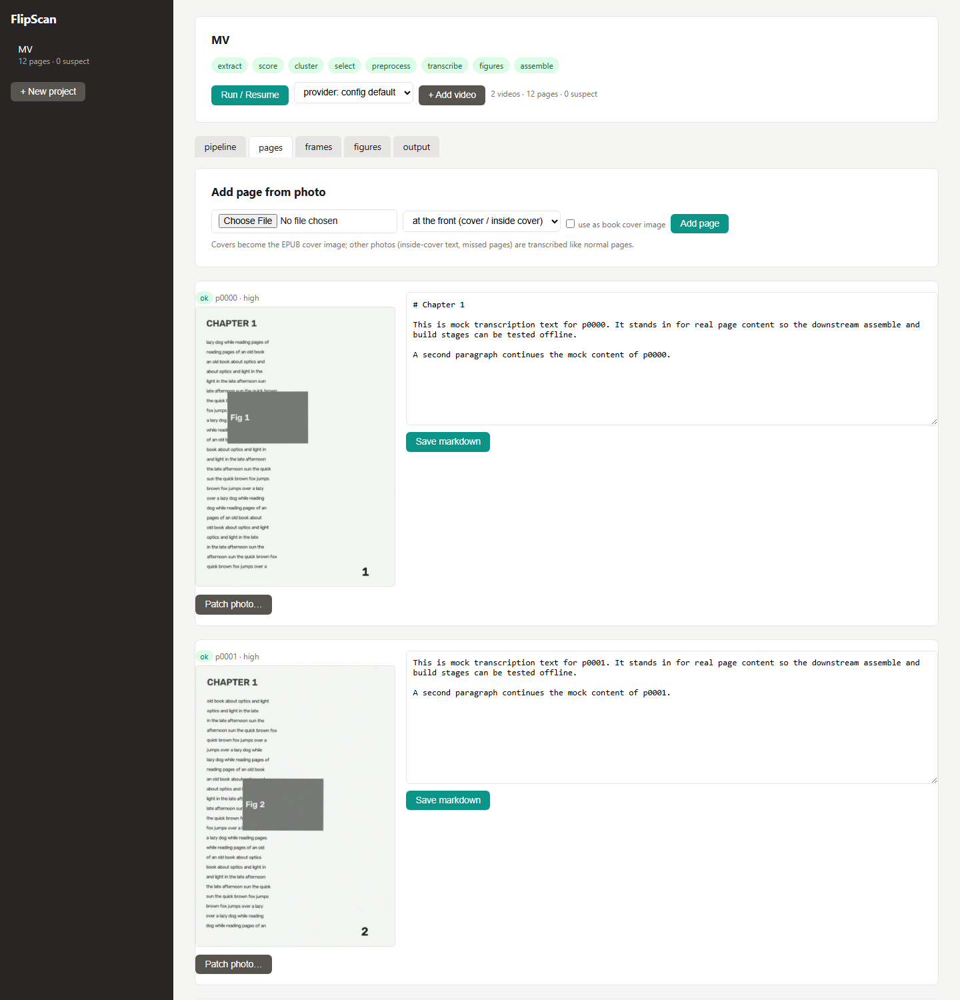

# FlipScan

Turn an iPhone slow-motion video of thumbing through a book into a clean EPUB. FlipScan extracts frames from 120/240 fps flip-through videos, scores and clusters them to identify individual pages, picks the best frame per page, transcribes each page with a vision LLM (local Ollama, Anthropic API, or a hybrid of both), and assembles the result into an EPUB or PDF — surfacing any pages it couldn't capture well as a "reshoot list" instead of silently dropping them.

See [SPEC.md](SPEC.md) for the full architecture.



## Capture protocol: just keep filming until you have every page

Shoot slow-mo videos of flipping through the book — any direction, any subset of pages,
as many videos as you like. FlipScan matches pages **across videos** (perceptual hash +
printed page numbers): a page captured in several videos keeps its sharpest capture, and
pages only one video caught slot into the right place. Run the pipeline, look at the
result, and if pages are missing or blurry just **add another video** of that part of the
book and run again — already-good pages aren't re-transcribed.

Tips:

- Two passes in opposite directions works great: each pass catches the side of the spread
  that lays flat, so between them every page appears flat and unoccluded.
- Use 240 fps slow-mo if your phone supports it; more frames = more chances to catch each
  page at rest, and let each page rest briefly before flipping the next.
- Expect stiff pages near the covers to need an extra video or a photo — the review step
  lists exactly which pages are weak.

## Quickstart

### Docker (recommended)

```sh
docker compose up --build
# drop your videos into ./books, open http://localhost:8321
```

The `./books` folder is mounted as `/data` inside the container: videos go in, EPUBs/PDFs come out, and every workspace persists on the host. Set `FLIPSCAN_OLLAMA_URL` (your Ollama server's LAN IP works directly from the container) and `FLIPSCAN_PROVIDER` via environment or a `.env` file next to `docker-compose.yml`.

CLI through the same image:

```sh
docker compose run --rm flipscan init /data/mybook --video /data/flip1.mov --video /data/flip2.mov
docker compose run --rm flipscan run /data/mybook --provider hybrid
docker compose run --rm flipscan addvideo /data/mybook /data/flip3.mov   # more pages later
docker compose run --rm flipscan build /data/mybook
```

### Dev install (no Docker)

```sh
pip install -e ".[ui,pdf,dev]"   # requires ffmpeg on PATH
flipscan ui                      # prints your LAN URL, e.g. http://192.168.x.x:8321
```

### Using it from your phone

`flipscan ui` (and the Docker container) listen on all interfaces by default and print a
"your network" URL on startup — open that URL in your phone's browser:

- **New project → Video → choose file** uploads slow-mo videos straight from the camera roll.
- **Pages tab → Add page from photo** uploads normal photos for the **front cover** (tick
  "use as book cover image" — it becomes the EPUB cover), inside-cover / back-cover text
  pages, or any page the video missed. Non-cover photos are transcribed like normal pages.
- The same tab's **Patch photo…** button replaces a badly-captured page from the reshoot list.

If another device can't reach the URL on Windows, allow the port through the firewall once
(admin PowerShell): `netsh advfirewall firewall add rule name="FlipScan GUI" dir=in action=allow protocol=TCP localport=8321 profile=private`
— or click "Allow access" if Windows pops up its firewall dialog. Use `--host 127.0.0.1`
to keep the GUI private to this machine.

## CLI reference

```
flipscan init DIR --video V [--video V2 ...] [options]
    --direction forward|reverse optional per-video hint (order is fixed automatically
                                from cross-video page matches and printed numbers)
    --reverse                   shorthand: single video shot back-to-front
    --title TEXT                book title (EPUB metadata)
    --expected-pages N          warn if the detected page count differs

flipscan addvideo DIR VIDEO [--direction forward|reverse]
    Add another capture video to an existing project: shared pages merge (best
    capture wins), new pages slot into the order, and only pages whose best
    frame changed get re-transcribed. Keep adding until every page is covered.

flipscan run DIR [--stage STAGE] [--force] [--provider ollama|anthropic|hybrid|mock]
                 [--model NAME] [--ollama-url URL]
    Runs extract -> score -> cluster -> select -> preprocess -> transcribe ->
    figures -> assemble. Resumable: completed stages are skipped unless --force.
    --stage re-runs a single stage.

flipscan status DIR             stage status + page counts

flipscan review DIR             static HTML review page + reshoot list

flipscan patch DIR --page ID IMG
    Replace a badly-captured page with a re-shot photo; re-runs preprocess and
    transcription for that page and resets figures/assemble.

flipscan addpage DIR IMG [--position start|end|N] [--cover]
    Add a page from a photo: --cover makes it the EPUB cover image (excluded
    from body text); otherwise it's transcribed like a normal page (inside-cover
    text, missed pages).

flipscan build DIR [-o FILE] [--format epub|pdf|pdf-facsimile] [--title T] [--author A]
    --format is repeatable; default epub. Outputs land in DIR/out/.

flipscan ui [--root DIR] [--host H] [--port 8321]
    Local web GUI over the projects folder (default: FLIPSCAN_ROOT or cwd).
```

## Configuration

Per-workspace `config.toml` (all keys optional — these are the defaults):

```toml
[provider]
name = "ollama"                  # ollama | anthropic | hybrid | mock
ollama_url = "http://localhost:11434"
ollama_model = "gemma4"
ollama_num_predict = 4096        # output token budget for dense pages
anthropic_model = "claude-sonnet-4-6"
escalate_on = ["low_confidence", "malformed_json", "flags"]   # hybrid triggers

[extract]
jpeg_quality = 2                 # ffmpeg -qscale:v

[score]
w_sharpness = 1.0                # composite-score weights (weighted product)
w_flatness = 1.0
w_occlusion = 1.0
w_motion = 1.0
center_crop = 0.6                # frame fraction used for sharpness

[cluster]
turn_min_frames = 4              # sustained high-motion run = page turn
min_cluster_frames = 3           # smaller clusters flagged suspect
motion_spike_factor = 2.5        # rest = motion below median * factor
suspect_score_percentile = 10

[preprocess]
llm_long_edge = 1600             # LLM copy downscale (token cost vs legibility)
quad_pad = 0.025                 # crop padding so page numbers survive
dewarp = false                   # cylindrical curl correction

[transcribe]
max_retries = 1
```

Environment overrides (take precedence over `config.toml`): `FLIPSCAN_PROVIDER`, `FLIPSCAN_OLLAMA_URL`, `FLIPSCAN_OLLAMA_MODEL`, `FLIPSCAN_ANTHROPIC_MODEL`, `FLIPSCAN_ANTHROPIC_API_KEY` (falls back to `ANTHROPIC_API_KEY`), `FLIPSCAN_ROOT` (GUI projects folder), `FLIPSCAN_FFMPEG`/`FLIPSCAN_FFPROBE` (binary paths).

## Backends

- **Ollama** (default): your existing Ollama server — just an HTTP endpoint. Free, private, slower and less accurate on dense text. Requests use `format: json` and a strict schema.
- **Anthropic**: higher accuracy, uses the **Message Batches API** (50% discount; a 300-page book is one batch, typically done within the hour).
- **Hybrid** (`--provider hybrid`): best cost/quality — every page goes through Ollama first; pages that come back with low confidence, malformed JSON, or quality flags are re-run through Anthropic. Tune what escalates via `escalate_on` (any of `low_confidence`, `malformed_json`, `flags`). Benchmark both backends on ~10 real pages early: if your local model misreads more than you can tolerate, keep all three triggers; if it does well, drop `flags` to cut API spend.
- **Mock**: placeholder text, no model calls — for testing the pipeline plumbing.

## Pipeline

```
ingest -> extract -> score -> cluster -> select -> preprocess -> transcribe -> figures -> assemble -> build
```

Every stage is idempotent and resumable; state lives in the workspace's `manifest.json`.

| Stage | What it does | Writes |
|---|---|---|
| init (ingest) | copies videos, probes real capture fps (stream-level — slow-mo containers lie) | `videos/`, `manifest.json` |
| extract | dumps every frame as JPEG q=2 | `frames/<vid>/` |
| score | per-frame sharpness, page-quad flatness, thumb occlusion, motion, pHash | `work/scores_<vid>.json` |
| cluster | rest-segment detection + pHash merge -> page identities; cross-video page matching (best capture wins, auto-orientation); gap warnings | `manifest.json` pages |
| select | best composite-scored frame per page + debug contact sheet | `work/contact_sheet.jpg` |
| preprocess | page crop, perspective correction, optional dewarp, contrast-normalized LLM copy | `work/pages/` |
| transcribe | vision LLM -> strict JSON (markdown, printed page number, regions, flags); printed-number monotonicity check | `pages/*.md` |
| figures | expand + snap LLM bboxes, crop from color frames, insert into markdown | `figures/` |
| assemble | concatenate pages, heal hyphenation, merge split paragraphs, strip running headers | `work/book.md` |
| build | EPUB / PDF outputs | `out/` |

**Check the contact sheet** (`work/contact_sheet.jpg`) after the first run on a new book — one thumbnail per detected page, red borders on suspects. If clustering miscounted, tune `[cluster]` thresholds before burning transcription tokens.

## Review / reshoot / patch

```sh
flipscan review mybook/    # writes mybook/review/index.html
```

The review page shows each page's corrected frame next to its rendered markdown, highlights suspects, and prints a **reshoot list** ("re-photograph pages 87, 143 individually"). Re-photograph those pages flat (normal photo mode is fine), then:

```sh
flipscan patch mybook/ --page p0086 photo.jpg
flipscan run mybook/ && flipscan build mybook/
```

The GUI (`flipscan ui`) offers the same workflow with inline markdown editing and patch upload.

## Output formats

| Format | Best when | Notes |
|---|---|---|
| `epub` | transcription quality is good; you want reflowable text | figures embedded, TOC from chapter headings |
| `pdf-facsimile` | quality is marginal or layout matters | corrected page **images** with an invisible searchable text layer; robust to transcription errors; no extra dependencies |
| `pdf` | you want a printable reflowed document | needs weasyprint (in Docker) or pandoc on PATH |

## Troubleshooting

- **Wrong page count / cluster miscounts** — check `work/contact_sheet.jpg`. Duplicated pages: raise `[cluster] hash_threshold` (more merging). Merged distinct pages: lower it. Fragmented pages (many tiny clusters): raise `motion_spike_factor`. Pass `--expected-pages` to get a count check.
- **"printed page numbers not monotonic" warning** — the most reliable gap signal: a page was missed, duplicated, or matched wrongly across videos. Inspect the review page around the named pages; adding another video of that stretch usually fixes it.
- **Blurry pages / low-confidence transcriptions** — they're on the reshoot list; patch them. If *many* pages are blurry, re-shoot the pass with more light and slower flipping.
- **Curled page text bows near the spine** — set `[preprocess] dewarp = true` and re-run `flipscan run DIR --stage preprocess` (then transcribe onward with `--force`).
- **Local model returns garbage JSON** — happens more with small models; the schema is deliberately flat and retried once, then escalated in hybrid mode. Try a larger model variant or hybrid.
- **ffmpeg not found** — install it (`winget install Gyan.FFmpeg` / `apt install ffmpeg`) or set `FLIPSCAN_FFMPEG`.
- **Reflowed PDF fails outside Docker** — install pandoc or use `pdf-facsimile` (works everywhere).
- **Ollama unreachable from Docker** — use the Ollama box's LAN IP in `FLIPSCAN_OLLAMA_URL`; `host.docker.internal` only if Ollama runs on the Docker host itself.

## Implementation status

- [x] M0 Repo setup
- [x] M1 Workspace + manifest + init/extract
- [x] M2 Scoring + clustering + selection (+ contact sheet) — validated on synthetic two-pass video (`tools/make_test_video.py`); validate on a real book video before trusting thresholds
- [x] M3 Preprocess (crop/perspective)
- [x] M4 Transcribe (backends + JSON schema)
- [x] M5 Assemble + EPUB
- [x] M6 Review HTML + patch flow
- [x] M7 Figures pipeline
- [x] M8 PDF outputs
- [x] M9 GUI (`flipscan ui`)
- [x] M10 Docker packaging
- [x] M11 Dewarp (simple cylindrical), tuning, tests, polish

## Development

```sh
python tools/make_test_video.py /tmp/tv --pages 12   # synthetic two-pass ground truth
flipscan init /tmp/book --video /tmp/tv/odd.mp4 --pages odd --direction reverse \
                        --video /tmp/tv/even.mp4 --pages even --direction forward \
                        --expected-pages 12
flipscan run /tmp/book --provider mock
flipscan build /tmp/book --format epub --format pdf-facsimile
```

Personal-use digitization of books you own; no DRM circumvention involved.
